# Deepbrid Downloader

[](https://github.com/developper001/Deepbrid-Downloader/actions/workflows/ci.yml)
[](https://github.com/developper001/Deepbrid-Downloader/releases/latest)
[](https://www.python.org/downloads/)
[](https://github.com/developper001/Deepbrid-Downloader/blob/main/LICENSE)

A small cross-platform desktop downloader built with Python and Tkinter for Deepbrid-hosted files. It queues links, keeps progress in SQLite, resumes interrupted transfers when the server supports HTTP Range requests, and exposes a compact, easy-to-monitor interface for daily downloads.

### Main dashboard

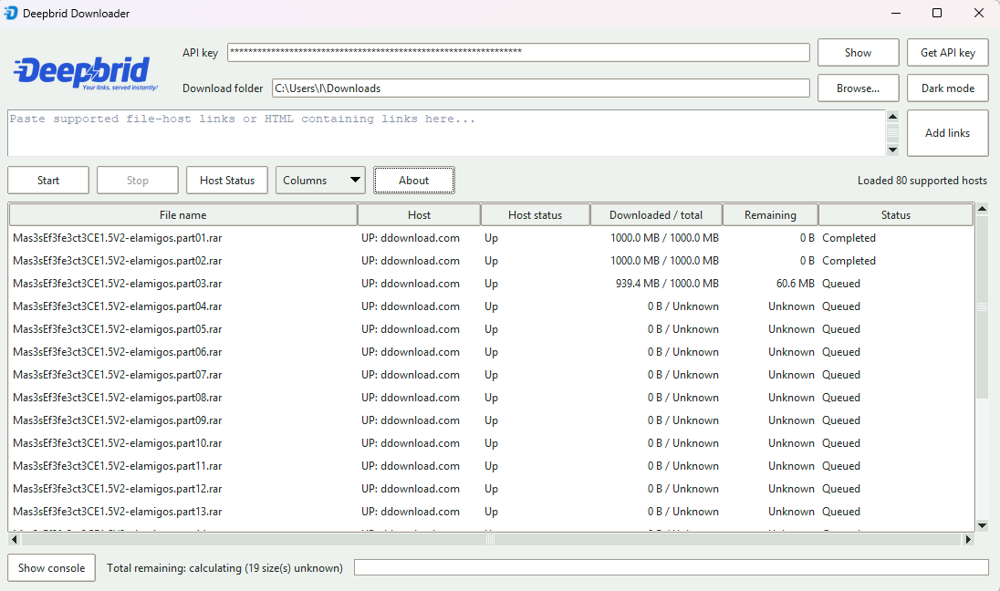

## Supported platforms

- Windows 10/11
- macOS 12+
- Linux (Ubuntu and other mainstream distributions with Tkinter available)

## Requirements

- Python 3.10+
- Tkinter support for your OS
- `cryptography>=42`
- `platformdirs>=4`

## Installation

```sh
python -m pip install --upgrade pip
python -m pip install -r requirements.txt
```

Then run:

```sh
python -m src.app
```

Or use the launcher:

```sh
python launcher.py
```

## Run

Use Python 3.10 or newer with Tkinter available. Install the dependencies and launch the app from the project root:

```sh
python -m pip install -r requirements.txt
python -m src.app
```

On Linux, Tkinter may need to be installed through the operating system package manager. The queue, API key, generated Deepbrid URLs, and encryption key are stored in the per-user application-data directory provided by `platformdirs`; they persist independently of the executable's bundle location. Existing source-tree databases, legacy queue databases, and `.env` keys are migrated when possible.

## How to use

- Select **Add file-host links** to open the resizable link-entry window, paste one or more supported links or HTML containing links, then choose **Add to queue**. Use **Host status** in that window to view and refresh supported hosts.
- The app filters for hosts supported by Deepbrid and ignores unsupported ones. It accepts supported links even when a host is currently unavailable, including comma-separated host aliases.
- Queue priority follows the displayed row order and updates when links are added, removed, or sorted.
- Rows show status, downloaded/total bytes, remaining bytes, per-file ETA, and optional size-verification results.
- The bottom progress bar tracks settled enabled links plus the active file's partial progress; its caption shows queue count and total ETA.
- The total ETA estimates unknown queued file sizes from the average size of completed downloads when a sample is available.
- Use the Configure columns dialog to show or hide fields, change their order, or reset the layout to defaults. The file extension is shown by default, after the file name. Resize table columns as needed; the horizontal scrollbar appears when visible columns no longer fit.
- Click a row to select it, press Ctrl+A to select all queued links, Ctrl-click to add or toggle rows, or Shift-click to select a range; right-click a selected row to apply context-menu actions to the selection in display order.
- The Host Status window is available from Settings and the file-host link-entry window. It opens with the last cached host list, then refreshes availability and daily quotas in the background. Search by host or sort by any column.
- The app keeps active partial files and automatically resumes queued work after startup. Closing the window requests a safe stop and waits for the active network read to return before exit, preserving the partial file for resume.
- If the API key is missing or rejected, the app opens the filtered API-key Settings automatically. Use the Get API key button there to retrieve a key, then use Check API key to verify it.
- Use the About window to open the GitHub repository and check whether a newer release is available.
- In Settings, use **Start after login** to toggle automatic startup on Windows/Linux or open macOS Login Items settings to add the app there. This starts the app after signing in; queued-download auto-start remains a separate option.

## Retry and resume behavior

If premium-link generation fails transiently, the app makes up to five attempts with a short pause between them, then falls back to hourly retries until it succeeds or is stopped. Cloudflare's browser-signature block and Deepbrid's unsupported-filehost response are treated as non-retryable and pause the queue. When the host reports an expected file size, the app checks the received byte count before marking the download complete; mismatches fail and keep the partial file for retry. If the host provides no expected size, the completed file is marked not verified. Requests use the documented Deepbrid API and the app's user agent identifier, and active downloads keep their partial files for a clean resume.

## Usenet Finder

The **Find Usenet links** button opens a separate window that searches Usenet results and resolves selected entries into file links. Enter a query, optionally enter a category identifier, and select a result to resolve its file list. Use **Add selected to queue** or **Add all accessible to queue** to add resolved files with valid HTTP(S) links. Unavailable files cannot be queued. Finder-reported file sizes are carried into the queue as estimates until transfer details provide an actual size. Usenet downloads use the URLs returned by Finder and the normal resumable queue transfer; click **Start** to begin and **Pause** to pause the queue, then click **Start** to resume.

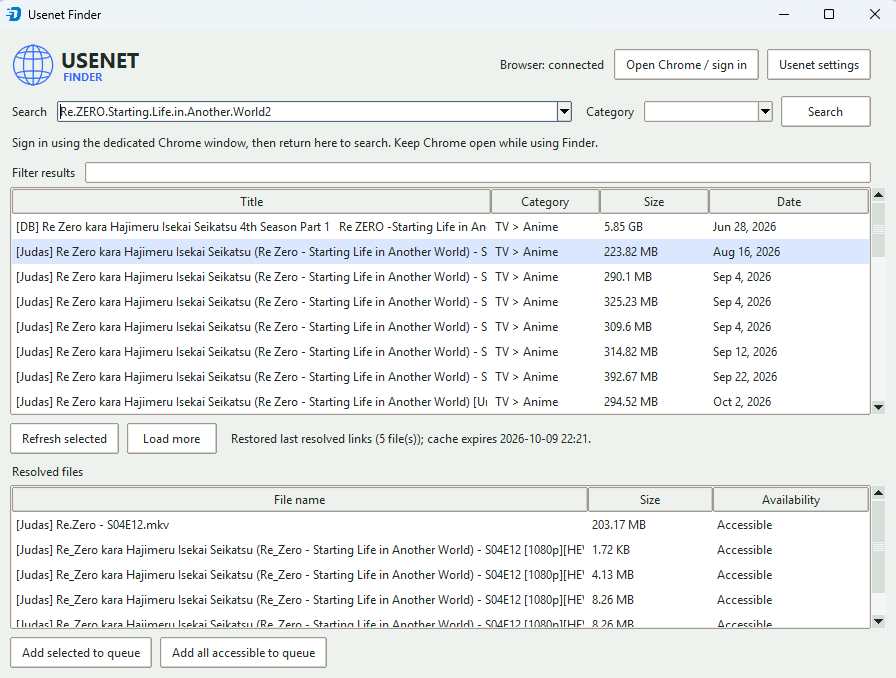

The last query and category are saved and restored when the Finder window is reopened. If the first page of that search is still cached, it is shown immediately without requiring another Search click. Finder also restores the last selected row and its resolved file links while they remain within the configured cache duration. Search result pages and successfully resolved packages are cached locally in encrypted form. Their shared cache duration is configurable in Settings from 1 to 720 hours (24 hours by default); use **Usenet settings** in the Finder window to change it or clear both caches.

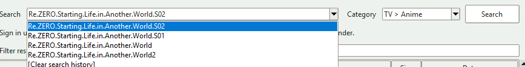

The Finder checks the dedicated browser connection periodically with a lightweight local status check. Cached results show their expiry time. Recent searches can be selected again; choose **[Clear search history]** in the search history or use **Clear search history** in Settings to remove them. Result categories populate the category picker, and search results and resolved files can be sorted by clicking a column heading. Use **Search columns...** and **File columns...** to show, hide, and reorder columns in each table; the resolved-files extension column is visible by default. **Hide PAR2/NFO** is enabled by default and temporarily filters parity archives and NFO files out of the resolved-file list; the files remain part of the package and are still included by **Add all accessible to queue**. Change this under **Usenet resolved files** in Settings or toggle it in the Finder; the choice is saved between runs. Use **Test browser connection** in Settings to check the dedicated browser connection on demand.

Usenet Finder requires Google Chrome or Microsoft Edge to be installed. The app opens a dedicated browser window automatically and uses an isolated profile stored under the application's data directory with loopback-only DevTools. If neither browser is found, the app explains how to install one:

- Windows: download Chrome or Edge from its official site, run the installer, then reopen Finder.
- macOS: download Chrome or Edge from its official site, open the downloaded installer, and follow its instructions.
- Ubuntu/Debian: download the Chrome or Edge `.deb` package from its official site, open the downloaded package in the Software Installer, and choose **Install**. On other Linux distributions, use the package offered for that distribution.

If a browser is already installed but is not detected, set `DEEPBRID_CHROME_PATH` to its executable. Complete any Cloudflare verification and sign in in the dedicated browser, then return to the app and search. Keep that browser window open while using Finder: search and resolve requests run within its signed-in session. Session cookies remain in the browser and are never copied into Python. The profile persists between launches. No downloader API key or account credential fields are used for Finder; obsolete Finder username/password settings are removed when the app starts. The **Open Chrome / sign in** button remains available to reopen the browser if needed.

To probe it from the UI, open **Usenet Finder**, sign in through the automatically opened browser if needed, then search. The optional CLI probe also opens or reuses the dedicated Chrome profile; sign in there first and then run:

```sh
python -m scripts.probe_usenet_finder "example search" --limit 1 --resolve-first
```

The probe prints response structure and request diagnostics. Endpoint behavior may change without notice. Install `websocket-client` from the project requirements to enable local Chrome DevTools communication.

## Features

- Queue and manage many Deepbrid-supported links from a single interface
- Add links for supported hosts even when their current availability is down; recognize comma-separated host aliases
- Keep API keys encrypted in SQLite instead of storing them in plain text
- Resume interrupted transfers using hidden `.part` files and range-aware downloads
- Open a searchable, sortable Host Status window with live availability and daily quota details
- Show the cached host list immediately, then refresh it in the background; open API-key Settings when Deepbrid returns HTTP 401
- Select multiple queue rows with Ctrl-click or a Shift-click range, then apply context-menu actions in display order
- Press Ctrl+A in the queue to select all links; selected text remains legible in light mode
- Track queue-wide progress with a compact bar that includes the active file's partial progress
- See each link's download progress in a bar; enable the optional percentage column in Configure columns when needed
- See per-file ETAs and an estimated total, including average-size estimates for queued files whose sizes are unknown
- Check whether a completed download's size matched the expected size reported by its host
- Retry blocked or failed links safely, with a pause-and-resume workflow
- Stop active downloads safely when closing the app; partial files are kept for resume
- Open a searchable Settings window for the API key, download folder, appearance, startup behavior, and queue columns; preferences are saved between runs
- Check the API key from Settings and switch themes directly from the dashboard; startup downloads are enabled by default
- Toggle dark mode, show or hide the console, and customize column visibility and order with a reset-to-defaults option
- Keep table heading hover, the About README, and update-download progress readable in dark mode
- Open API-key Settings automatically at startup when the key is missing or rejected; access the Deepbrid key page from Settings
- Check for newer releases in About and opt into verified in-app updates with download progress
- Use the user's OS Downloads folder by default when available, retaining a saved folder choice
- Optionally append application output to a chosen log file from Settings; logging is disabled by default, defaults to `deepbrid-output.log` beside the executable when enabled without a saved path, and redacts URLs
- Route standard output, errors, and uncaught exceptions to the in-app console
- Build the Windows executable with the Deepbrid icon and no separate console window
- Open the full project README directly from the About window

## Screenshots

### Settings

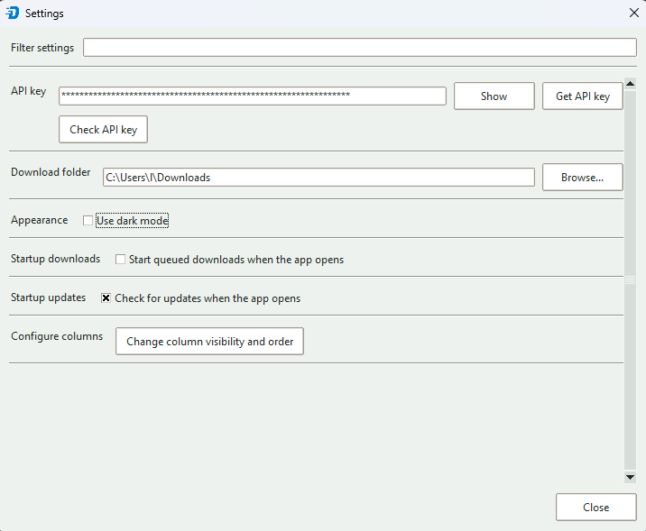

### Host status and quota overview

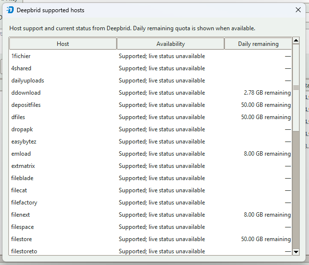

### About and release updates

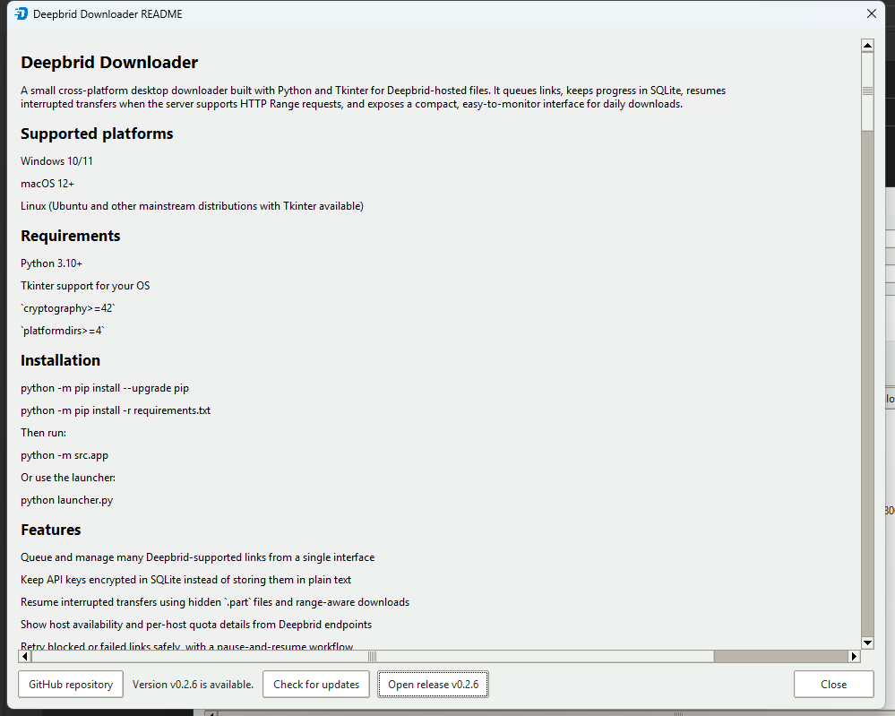

### Column visibility and queue management

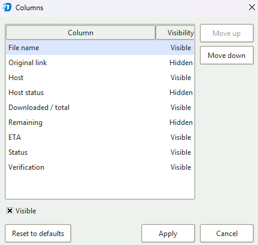

### Right-click actions and retry flow

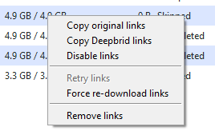

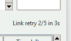

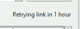

### Dark mode and console logging

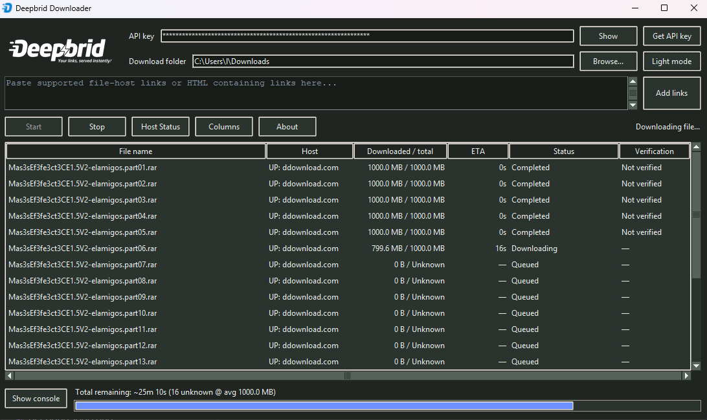

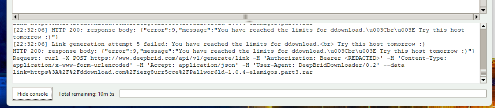

## Tests

The project uses the standard library unittest suite. Run it locally with:

```sh
python -m unittest -q tests.test_downloader tests.test_queue
```

## Torrent downloads

Open **Add torrents**, then choose **Select .torrent file(s)** to select one or more files or **Select torrent folder** to scan a folder and its subfolders. Torrent uploads are limited to 5 MiB each and require a Deepbrid Premium account and API key. The app submits torrents and checks their cloud-job status through the Deepbrid API; Chrome does not need to be open. When a torrent is ready, its returned files are added to the regular download queue and downloaded to the configured output folder. The app keeps the torrent job ID and requests fresh download links when needed because those links expire.

GitHub Actions runs the same tests on pushes to `main` and pull requests across Ubuntu, Windows, and macOS for supported Python versions. The dependency audit runs weekly only and skips the platform test matrix.

## GitHub CI

This repository uses GitHub Actions for CI, weekly dependency audits, and tag-based releases. Workflow actions use Node 24-compatible releases.

It runs:
- Python 3.10
- Python 3.11
- Python 3.12
- on Windows, macOS, and Ubuntu
- `python -m unittest -q tests.test_downloader tests.test_queue`
- a package build step with `python -m build`

## Minimal installer for Windows, macOS, and Linux

For a public repo, the minimal production path is to keep the source public and ship platform build artifacts as a GitHub Release.

Recommended minimal pipeline:
- publish the source repo publicly
- tag a release using the version in `src/app_info.py`, in the form `vX.Y.Z`
- let GitHub Actions build the app for Windows, macOS, and Linux
- attach the binaries and the generated checksum file to the release

Build and release steps:

```sh
python -m pip install --upgrade pip
python -m pip install -r requirements.txt
python -m pip install build pyinstaller
python -m build
python -m PyInstaller --onefile --windowed launcher.py
```

Create the git tag and push it:

```sh
RELEASE_VERSION=X.Y.Z # Replace with the version from src/app_info.py
git tag "v${RELEASE_VERSION}"
git push origin "v${RELEASE_VERSION}"
```

The GitHub release workflow verifies that the tag matches `src/app_info.py`, then publishes stable platform binaries (for example, `DeepbridDownloader-Windows.exe`) and a `sha256sums.txt` file. Release `v0.2.10` also included versioned compatibility aliases for older updater builds; future releases publish only stable filenames.
The Windows build embeds the Deepbrid icon and runs without opening a separate terminal console; output and uncaught exceptions are routed to the app's in-app console.
Packaged builds can download the matching platform binary, verify its GitHub SHA-256 digest, and restart into the replacement executable. Running from source continues to open the release page instead of replacing the Python environment.

Notes:
- `pyinstaller` is the simplest way to produce a single-file app for Windows/macOS/Linux.
- For a more polished distribution, a native installer such as an MSI or DMG is better than a bare executable.
- The repo remains the source of truth; the GitHub release is the production distribution.

## Signature

This project was coded with Copilot.

## License

This project is licensed under the MIT License. See [LICENSE](LICENSE) for the full license text.

MIT License

Copyright (c) 2026 Deepbrid Downloader contributors

Permission is hereby granted, free of charge, to any person obtaining a copy
of this software and associated documentation files (the "Software"), to deal
in the Software without restriction, including without limitation the rights
to use, copy, modify, merge, publish, distribute, sublicense, and/or sell
copies of the Software, and to permit persons to whom the Software is
furnished to do so, subject to the following conditions:

The above copyright notice and this permission notice shall be included in all
copies or substantial portions of the Software.

THE SOFTWARE IS PROVIDED "AS IS", WITHOUT WARRANTY OF ANY KIND, EXPRESS OR
IMPLIED, INCLUDING BUT NOT LIMITED TO THE WARRANTIES OF MERCHANTABILITY,
FITNESS FOR A PARTICULAR PURPOSE AND NONINFRINGEMENT. IN NO EVENT SHALL THE
AUTHORS OR COPYRIGHT HOLDERS BE LIABLE FOR ANY CLAIM, DAMAGES OR OTHER
LIABILITY, WHETHER IN AN ACTION OF CONTRACT, TORT OR OTHERWISE, ARISING FROM,
OUT OF OR IN CONNECTION WITH THE SOFTWARE OR THE USE OR OTHER DEALINGS IN THE
SOFTWARE.
